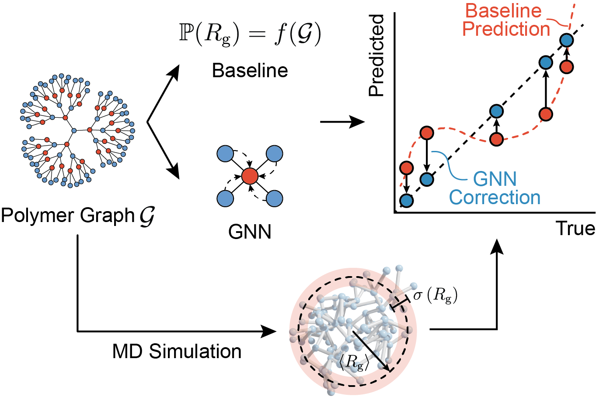

# Physics-Guided Neural Networks for Transferable Prediction of Polymer Properties

<br />

<br />

## Install Instructions

Please install using the `setup.py`.

```console
$ git clone https://github.com/webbtheosim/gcgnn.git
$ cd gcgnn
$ conda create --name gcgnn python=3.8.16
$ conda activate gcgnn
$ # or source activate gcgnn
$ pip install -e .
```

## Download Data and Results
Select a disk location for data storage and update the directory paths before running the program. Download the required data from Zenodo [here](https://doi.org/10.5281/zenodo.13619700).
- **DATA_DIR**: Stores data pickle files (approx. 210 MB).

Additional training weights and results can be downloaded  [here](https://drive.google.com/drive/folders/14REH3x3MEzpC0st77jwlDL4Rw-N1Vvfq?usp=drive_link)
- **TRAIN_RESULT_DIR** or **HIST_DIR** (optional): Stores training results in pickle format (approx. 2.5 GB).
- **MODEL_DIR** (optional): Stores training weights in .h5 format (approx. 1.3 GB).

To train from scratch, only the **DATA_DIR** is required.
```python
# LOAD SIMULATION DATA
DATA_DIR = "your/custom/dir/"
mw = 40 # or 90, 190 MWs

filename = os.path.join(DATA_DIR, f"pattern_graph_data_{mw}_{mw+20}_rg_new.pickle")
with open(filename, "rb") as handle:
    graph = pickle.load(handle)
    label = pickle.load(handle)
    desc  = pickle.load(handle)
    meta  = pickle.load(handle)
    mode  = pickle.load(handle)
    rg2_mean   = pickle.load(handle)
    rg2_std    = pickle.load(handle) ** 0.5 # var

# combine asymmetric and symmetric star polymers
label[label == 'stara'] = 'star'
# combine bottlebrush and other comb polymers
label[label == 'bottlebrush'] = 'comb' 

# LOAD GAUSSIAN CHAIN THEORETICAL DATA
with open(os.path.join(DATA_DIR, f"rg2_baseline_{mw}_new.pickle"), "rb") as handle:
    rg2_mean_theo = pickle.load(handle)[:, 0]
    rg2_std_theo = pickle.load(handle)[:, 0]
```

## File Structure

To reproduce the figures and tables, refer to the **notebook** folder:
- **figure_data.ipynb**: Visualizes polymer architecture and chemical patterns used in the study.
- **figure_result.ipynb**: Visualizes all result figures from the paper.

The core code is located in the **gcgnn** folder:

- **train.py**: Handles the training of GC, GNN, and GC-GNN models, including setup and execution.
- **model_utils.py**: Provides utility functions to support model training processes.
- **gen_base_rg2.py**: Generates theoretical mean and standard deviation values for Gaussian Chain squared radius of gyration squared.
- **analysis**: Contains scripts to calculate and evaluate accuracy metrics for model predictions.
- **gen_data**: Scripts for generating unique polymer architectures, represented as graph structures.
- **gen_pattern**: Assigns specific chemical patterns to the generated polymer architectures.
- **model_data**: Preprocesses datasets, including feature extraction and formatting, for model training.
- **models**: Defines the architecture and implementation of various machine learning models used in the study.
- **plot**: Scripts to create visual representations of data, including figures for analysis and publication.

The **result_temp** and **csv_result** folders contain temporary files used for figure preparation and table creation. To generate your own results, set `rerun=True` in notebooks.

The **submit** folder contains job submission scripts tailored for High-Performance Computing environments.
- **submit_train.submit**: Train neural networks.
- **gen_base_rg2.submit**: Generate all theoretical Rg predictions.
